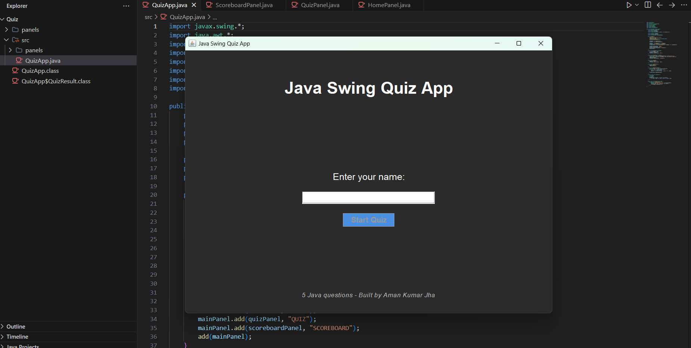
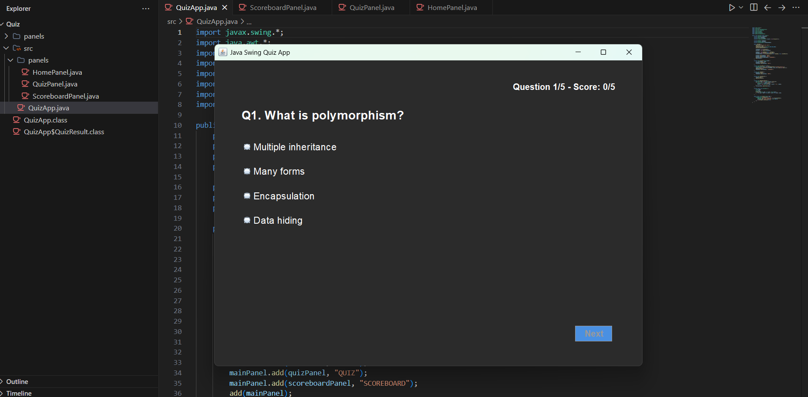
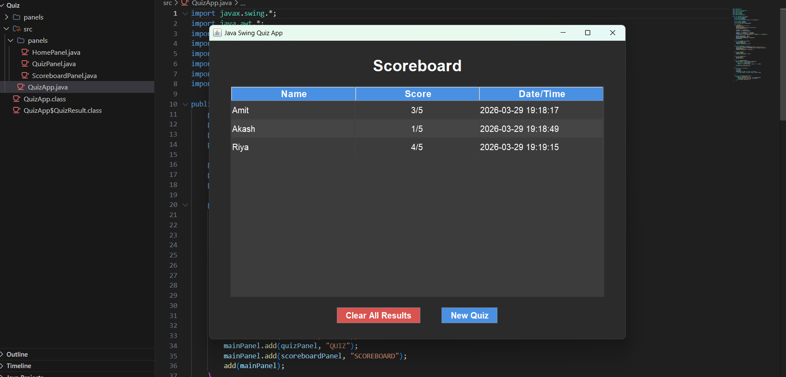

# Java Swing Quiz Application

A professional, single-runnable desktop quiz application built with Java Swing. It features a modern dark-themed user interface, seamless screen transitions via CardLayout, and a built-in scoreboard to track performance across multiple quiz attempts.

## Features

- **Modern Dark Theme**: A sleek, user-friendly interface optimized for readability and high-quality aesthetics.
- **Three-Screen Architecture**: Seamlessly navigate between the Home, Quiz, and Scoreboard screens using `CardLayout`.
- **Dynamic Quiz Engine**: Answer multiple-choice questions with immediate score tracking upon completion.
- **Persistent Scoreboard**: View past quiz attempts natively within the application, complete with names, scores, and timestamps.
- **MVC-Inspired Separation**: Clean codebase separating the main frame (`QuizApp`) from individual functional panels (`HomePanel`, `QuizPanel`, `ScoreboardPanel`).

---

## Screenshots

### Home Page

*Description: The starting screen where players enter their name to begin.*

### Quiz Page

*Description: The active quiz screen displaying questions and multiple-choice answers.*

### Scoreboard Page

*Description: The final results screen showing past player performances and timestamps.*

---

## Getting Started

### Prerequisites
- **Java Development Kit (JDK) 8** or higher installed on your machine.

### Installation & Execution

1. Clone or download this repository to your local machine.
2. Navigate to the project directory in your terminal.
3. Compile the Java files. Assuming you are in the project root (`c:\Project\Quiz`):
   ```bash
   javac -d bin src/*.java src/panels/*.java
   ```
4. Run the application:
   ```bash
   java -cp bin QuizApp
   ```
## Architecture Overview

The application uses a component-based structure to separate concerns:
- **`QuizApp.java`**: The main entry point. Manages the main `JFrame` and handles navigation between panels over a `CardLayout`. Stores shared state like results.
- **`panels/HomePanel.java`**: The landing screen input form.
- **`panels/QuizPanel.java`**: Handles the quiz logic, question rendering, and score calculation.
- **`panels/ScoreboardPanel.java`**: Renders a `JTable` containing all the historical quiz results.


## 👨‍💻 Author

**Aman Kumar Jha**  
Backend Engineer | Java SpringBoot | Microservices  

<p align="center">
  
</p>

<p align="center">
  <a href="https://www.linkedin.com/in/aman-kumar-j-14baa4120/">
    
  </a>
  &nbsp;&nbsp;&nbsp;
  <a href="https://github.com/amanjha491">
    
  </a>
